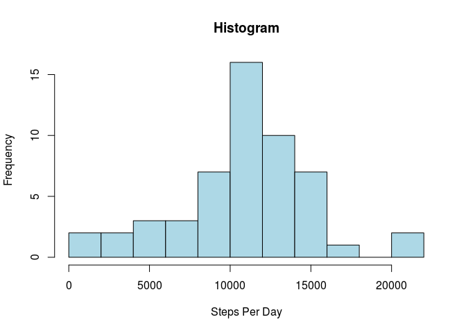
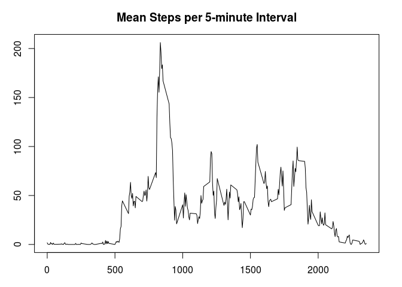
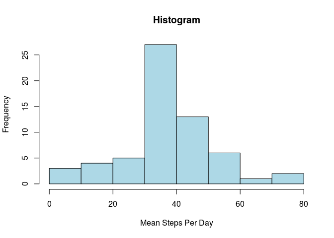
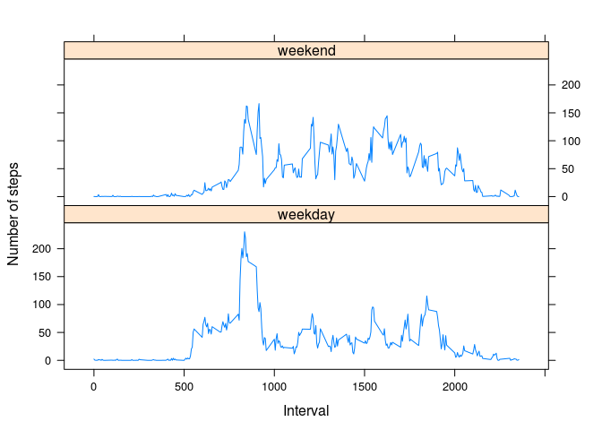

# Reproducible Research: Peer Assessment 1


```r
library(dplyr)
library(knitr)

# global options, to make code visible (echo=FALSE for the reverse)
opts_chunk$set(echo=TRUE, results='markup')
```

## Loading and preprocessing the data

Loading from dataset **activity.zip**. The file can be found in [forked Git repo for the assignment](https://github.com/ricardoZmestre/RepData_PeerAssessment1).


```r
# read directly compressed file
df <- read.csv(ff <- unz('activity.zip', 'activity.csv'), 
               colClasses = c('numeric', 'Date', 'numeric'))
#close(ff)
```

## What is mean total number of steps taken per day?

Histogram of the number of steps taken per day.


```r
### Question 1

# using dplyr, calculate mean total steps per day
dfDay <- df %>%
  filter(!is.na(steps)) %>%
  group_by(date) %>%
  summarise(steps=sum(steps))

hist(dfDay$steps, col='lightblue', breaks=10, 
     main = 'Histogram', xlab='Steps Per Day')
```

 

The overall total number of steps taken per day (which is the same as the overall number of steps *tout court*) is 570608.

The total number of steps per day of the week, and the corresponding mean, are given in the table below.


```r
kable(
  dfDay %>% 
    mutate(Day=factor(weekdays(date), 
                          c('Sunday', 'Monday', 'Tuesday', 'Wednesday', 
                            'Thursday', 'Friday', 'Saturday'))) %>% 
    group_by(Day) %>% 
    summarise('Total Steps'=sum(steps), 'Mean Steps'=mean(steps), 
              'Median Steps'=median(steps)),
  digits=2
  )
```


Day          Total Steps   Mean Steps   Median Steps
----------  ------------  -----------  -------------
Sunday             85944     12277.71        11834.0
Monday             69824      9974.86        10439.0
Tuesday            80546      8949.56         8918.0
Wednesday          94326     11790.75        12069.5
Thursday           65702      8212.75         8551.5
Friday             86518     12359.71        11829.0
Saturday           87748     12535.43        12426.0

<br>The mean of the steps taken per day is 10766.19.

The median of the steps taken per day is 10765.00.

## What is the average daily activity pattern?

The chart below shows the average pattern of activity per 5-minute interval across all days.


```r
dfmeanMin <- df %>%
  filter(!is.na(steps)) %>%
  group_by(interval) %>%
  summarise(steps=mean(steps))

oldpar=par(mar=c(3, 3, 3, 2))
plot(dfmeanMin$interval, dfmeanMin$steps, type='l', main='Mean Steps per 5-minute Interval',
     xlab='', ylab='')
```

 

```r
par(mar=oldpar)
```

The maximum mean number of steps per interval is 206.17.

The corresponding interval is 835.

These are the mean steps and interval for which a maximum is reached.

## Imputing missing values

NA imputation is done separately per interval, as per the second suggestion in the assignment, i.e. each interval with NA is imputed the same number of steps as the mean for that same interval when observed. For instance, an NA appearing in (say) interval 1800 will be replaced by the mean of all intervals 1800 in the dataset for which data are available. This imputation is simple enough but at the same time takes into account that some periods in the day have specificities, such as zero steps during most of the night.


```r
### Question 3

dfnan <- df
# filling out with mean per interval
for (interval in unique(dfnan$interval)) {
  dfnan[is.na(dfnan$steps) & dfnan$interval==interval, ]$steps <- 
    dfmeanMin[dfmeanMin$interval==interval, ]$steps
}

dfnanDay <- dfnan %>%
  group_by(date) %>%
  summarise(steps=sum(steps))
```


```r
hist(dfnanDay$steps, col='lightblue', breaks=10,
     main = 'Histogram', xlab='Mean Steps Per Day')
```

 

The number of Nas in the original dataset is 2304.

The mean of the steps taken per day, corrected for NAs, is 10766.19. Note that the mean has not changed: this is the consequence of the fact that NAs are evenly distributed by intervals, with 8 NAs per interval, and that each imputed interval  has by construction the same mean as the (non-imputed) observations for the corresponding interval. This implies that the numbers introduced into the data frame have the same overall mean as the original numbers (barring NAs), hence they do not alter the overall mean.

The median of the steps taken per day, corrected for Nas, is 10766.19. Note now that the median has changed and is similar to the mean. This is because we have, in the NA imputation, added numbers which are by construction closer to the centre of the distribution (because of the law of large numbers), which reduces the tails of the distribution and brings the median closer to the mean.

Just to check, the deciles of the original data (averaged per day) were:


```r
kable(quantile(dfDay$steps, na.rm=TRUE, probs=seq(from=0, to=1, by=0.1)),
      col.names=c('Steps'))
```

          Steps
-----  --------
0%         41.0
10%      5102.6
20%      8342.4
30%      9867.6
40%     10279.8
50%     10765.0
60%     11830.0
70%     12796.6
80%     13571.6
90%     15107.6
100%    21194.0

<br>And they are now:


```r
kable(quantile(dfnanDay$steps, na.rm=TRUE, probs=seq(from=0, to=1, by=0.1)),
      col.names=c('Steps'))
```

           Steps
-----  ---------
0%         41.00
10%      5441.00
20%      8821.00
30%     10119.00
40%     10571.00
50%     10766.19
60%     11162.00
70%     12426.00
80%     13452.00
90%     15098.00
100%    21194.00

<br>Note that the 50% percentile corresponds to the median.

## Are there differences in activity patterns between weekdays and weekends?

Let's chart by separate the mean steps per interval across weekends and weekdays.


```r
library(lubridate)
library(lattice)

dfwe <- dfnan
dfwe$dayofweek <- factor(ifelse(weekdays(dfwe$date) %in% c('Saturday', 'Sunday'), 
                 'weekend', 'weekday'))

dfweMin <- dfwe %>%
  #filter(!is.na(steps)) %>%
  group_by(dayofweek,interval) %>%
  summarise(steps=mean(steps))

xyplot(steps ~ interval | dayofweek, data=dfweMin, type='l', layout=c(1, 2),
       xlab='Interval', ylab='Number of steps')
```

 

Indeed: on weekends, the number of paces is more evenly distributed across the day and the day seems to start later; on weekdays, in contrast, there is clearly more activity early in the morning and quite a bit of walking to work (from around 8 to 9 in the morning), although the return home seems to be more spread out across time.

---
